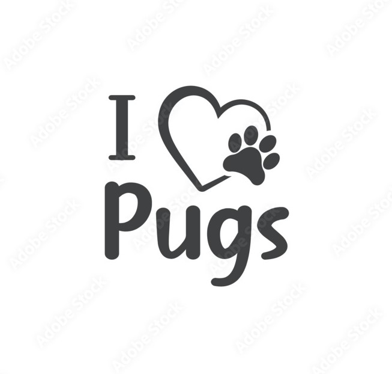

# 💫 About Me:
## 😎Personal Info
-👋 Hi, I’m @PanagiotaTr - 👀 I’m interested in web development, data science, AI, and cybersecurity. - 🌱 I’m currently learning additional programming languages and expanding my knowledge in cybersecurity. - 💞️ I’m looking to collaborate on open-source projects, especially those related to coding, data analysis, cybersecurity, and automation. - 📫 How to reach me: You can reach me through email at panayiota03@gmail.com. - 😄 Pronouns: She/Her - ⚡ Fun fact: I love learning new programming languages, diving into cybersecurity topics, and creating fun projects in my free time!

## 🐶 My Favorite Pet

## 🎶 My Favorite Singer

# 💻 Tech Stack:
                  
# 📊 GitHub Stats:

  
  

 

  

<picture>

  <source media="(prefers-color-scheme: dark)" srcset="https://raw.githubusercontent.com/PanagiotaTr/PanagiotaTr/output/github-snake-dark.svg" />
  <source media="(prefers-color-scheme: light)" srcset="https://raw.githubusercontent.com/PanagiotaTr/PanagiotaTr/output/github-snake.svg" />
  
  

</picture>
